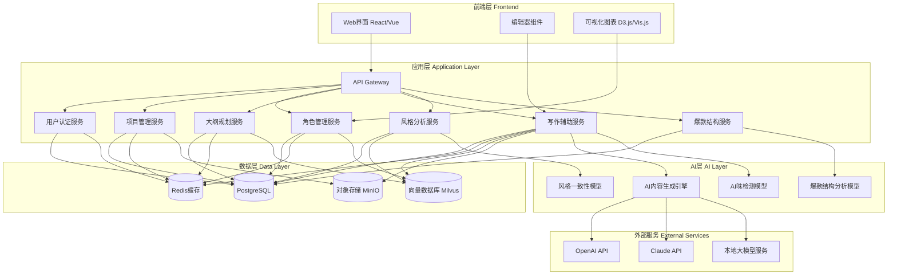

# 8万字网文小说智能写作系统 - 技术设计文档

Feature Name: ai-novel-writing-system
Updated: 2026-03-02

## 描述

本系统是一个基于AI技术的网络小说创作辅助平台,旨在帮助作者高效创作8万字以上的网络小说。系统集成了AI内容生成、角色管理、情节编排、爆款结构参考等核心功能,特别注重降低"AI味"和保持风格一致性,确保生成的内容自然、有文学性且符合网文市场的成功规律。

## 架构

### 系统架构图



### 技术栈选择

- **前端**: React 18 + TypeScript + Vite
- **后端**: Python 3.11+ (FastAPI)
- **数据库**: PostgreSQL 15
- **缓存**: Redis 7
- **向量数据库**: Milvus 2.3
- **对象存储**: MinIO
- **AI模型**: OpenAI GPT-4 / Claude 3 / 本地Llama 3
- **部署**: Docker + Docker Compose

## 组件和接口

### 1. 用户认证服务 (AuthService)

**职责**: 用户注册、登录、权限管理

**接口**:
- `POST /api/auth/register` - 用户注册
- `POST /api/auth/login` - 用户登录
- `POST /api/auth/refresh` - 刷新token
- `GET /api/user/profile` - 获取用户信息

**数据模型**:
```python
class User(BaseModel):
    id: UUID
    username: str
    email: str
    created_at: datetime
    subscription_tier: str  # free, pro, premium
```

### 2. 项目管理服务 (ProjectService)

**职责**: 小说项目创建、管理、导出

**接口**:
- `POST /api/projects` - 创建新项目
- `GET /api/projects` - 获取项目列表
- `GET /api/projects/{id}` - 获取项目详情
- `PUT /api/projects/{id}` - 更新项目信息
- `DELETE /api/projects/{id}` - 删除项目
- `POST /api/projects/{id}/export` - 导出小说

**数据模型**:
```python
class Project(BaseModel):
    id: UUID
    user_id: UUID
    title: str
    genre: str  # 玄幻, 都市, 言情, 悬疑
    target_word_count: int
    current_word_count: int
    created_at: datetime
    updated_at: datetime
```

### 3. 角色管理服务 (CharacterService)

**职责**: 角色CRUD、关系管理、图谱生成

**接口**:
- `POST /api/projects/{id}/characters` - 创建角色
- `GET /api/projects/{id}/characters` - 获取角色列表
- `PUT /api/projects/{id}/characters/{char_id}` - 更新角色
- `DELETE /api/projects/{id}/characters/{char_id}` - 删除角色
- `POST /api/projects/{id}/characters/{char_id}/relations` - 添加关系
- `GET /api/projects/{id}/characters/graph` - 获取角色图谱数据

**数据模型**:
```python
class Character(BaseModel):
    id: UUID
    project_id: UUID
    name: str
    age: int
    personality: List[str]
    appearance: str
    background: str
    traits: Dict[str, Any]
    created_at: datetime

class CharacterRelation(BaseModel):
    id: UUID
    source_char_id: UUID
    target_char_id: UUID
    relation_type: str  # friend, enemy, lover, family
    description: str
```

### 4. 大纲规划服务 (OutlineService)

**职责**: 大纲结构管理、情节编排、冲突检测

**接口**:
- `POST /api/projects/{id}/outline` - 创建大纲节点
- `GET /api/projects/{id}/outline` - 获取完整大纲树
- `PUT /api/projects/{id}/outline/{node_id}` - 更新节点
- `DELETE /api/projects/{id}/outline/{node_id}` - 删除节点
- `POST /api/projects/{id}/outline/reorder` - 调整节点顺序
- `GET /api/projects/{id}/outline/conflicts` - 检测逻辑冲突
- `POST /api/projects/{id}/outline/ai-generate` - AI辅助大纲规划

**数据模型**:
```python
class OutlineNode(BaseModel):
    id: UUID
    project_id: UUID
    parent_id: Optional[UUID]
    node_type: str  # volume, chapter, section
    title: str
    description: str
    order: int
    word_count_estimate: int
    involved_characters: List[UUID]
    created_at: datetime
```

### 5. 写作辅助服务 (WritingService)

**职责**: 章节生成、AI润色、内容修改

**接口**:
- `GET /api/projects/{id}/chapters` - 获取章节列表
- `GET /api/projects/{id}/chapters/{chapter_id}` - 获取章节内容
- `POST /api/projects/{id}/chapters` - 创建新章节
- `PUT /api/projects/{id}/chapters/{chapter_id}` - 更新章节
- `POST /api/projects/{id}/chapters/{chapter_id}/generate` - AI生成章节
- `POST /api/projects/{id}/chapters/{chapter_id}/polish` - AI润色
- `POST /api/projects/{id}/chapters/{chapter_id}/dialogue` - AI生成对话
- `POST /api/projects/{id}/chapters/autosave` - 自动保存

**数据模型**:
```python
class Chapter(BaseModel):
    id: UUID
    project_id: UUID
    outline_node_id: UUID
    title: str
    content: str
    content_format: str  # markdown, rich_text
    word_count: int
    status: str  # draft, completed, published
    ai_generated_ratio: float
    created_at: datetime
    updated_at: datetime

class GenerationRequest(BaseModel):
    chapter_id: UUID
    context: str
    style_hints: Optional[List[str]]
    reduce_ai_flavor: bool = True
    versions: int = 3
```

### 6. 风格分析服务 (StyleService)

**职责**: 风格基准建立、一致性检测、风格报告

**接口**:
- `POST /api/projects/{id}/style/establish` - 建立风格基准
- `GET /api/projects/{id}/style/baseline` - 获取风格基准
- `POST /api/projects/{id}/style/check` - 风格一致性检测
- `GET /api/projects/{id}/style/report` - 获取风格报告
- `PUT /api/projects/{id}/style/baseline` - 更新风格基准

**数据模型**:
```python
class StyleBaseline(BaseModel):
    id: UUID
    project_id: UUID
    sentence_patterns: List[str]
    vocabulary_profile: Dict[str, int]
    tone_markers: List[str]
    perspective: str  # 第一人称, 第三人称
    created_at: datetime

class StyleCheckResult(BaseModel):
    chapter_id: UUID
    consistency_score: float  # 0-100
    deviations: List[StyleDeviation]
    suggestions: List[str]

class StyleDeviation(BaseModel):
    type: str  # sentence_structure, vocabulary, tone
    location: str  # chapter:line
    description: str
    severity: str  # low, medium, high
```

### 7. 爆款结构服务 (ViralStructureService)

**职责**: 爆款模板管理、结构分析、节奏监控

**接口**:
- `GET /api/viral-structures` - 获取所有爆款结构模板
- `GET /api/viral-structures/{id}` - 获取结构详情
- `POST /api/projects/{id}/viral-structure` - 应用爆款结构
- `GET /api/projects/{id}/viral-structure/current` - 获取当前章节位置
- `POST /api/projects/{id}/viral-structure/customize` - 自定义结构
- `GET /api/projects/{id}/viral-structure/report` - 获取结构完整性报告
- `GET /api/viral-structures/{id}/analysis` - 获取成功案例分析

**数据模型**:
```python
class ViralStructureTemplate(BaseModel):
    id: UUID
    name: str
    genre: str
    description: str
    key_nodes: List[StructureNode]
    success_cases: List[SuccessCase]

class StructureNode(BaseModel):
    node_id: str
    name: str
    description: str
    position_percentage: float  # 在全书中的位置百分比
    writing_guidelines: List[str]
    is_critical: bool

class ProjectViralStructure(BaseModel):
    id: UUID
    project_id: UUID
    template_id: UUID
    custom_nodes: List[StructureNode]
    current_node: Optional[str]
    completion_score: float
```

### 8. AI内容生成引擎 (AIGenerationEngine)

**职责**: 文本生成、多版本生成、AI味降低

**核心组件**:
- Prompt模板管理器
- 模型路由器 (支持多模型切换)
- 后处理模块 (AI味检测和优化)
- 版本生成器

**接口**:
```python
async def generate_chapter(
    context: str,
    style_baseline: StyleBaseline,
    viral_structure: Optional[StructureNode],
    reduce_ai_flavor: bool = True
) -> List[str]:
    """生成多个版本的章节内容"""

async def reduce_ai_flavor(text: str) -> str:
    """降低AI味处理"""

async def check_ai_flavor(text: str) -> AIFlavorScore:
    """检测AI味程度"""

async def generate_dialogue(
    characters: List[Character],
    scene: str,
    context: str
) -> List[DialogueTurn]:
    """生成角色对话"""
```

## 数据模型

### 数据库设计

#### 用户表 (users)
```sql
CREATE TABLE users (
    id UUID PRIMARY KEY DEFAULT gen_random_uuid(),
    username VARCHAR(50) UNIQUE NOT NULL,
    email VARCHAR(100) UNIQUE NOT NULL,
    password_hash VARCHAR(255) NOT NULL,
    subscription_tier VARCHAR(20) DEFAULT 'free',
    created_at TIMESTAMP DEFAULT CURRENT_TIMESTAMP,
    updated_at TIMESTAMP DEFAULT CURRENT_TIMESTAMP
);
```

#### 项目表 (projects)
```sql
CREATE TABLE projects (
    id UUID PRIMARY KEY DEFAULT gen_random_uuid(),
    user_id UUID NOT NULL REFERENCES users(id),
    title VARCHAR(200) NOT NULL,
    genre VARCHAR(50) NOT NULL,
    target_word_count INT DEFAULT 80000,
    current_word_count INT DEFAULT 0,
    created_at TIMESTAMP DEFAULT CURRENT_TIMESTAMP,
    updated_at TIMESTAMP DEFAULT CURRENT_TIMESTAMP
);
```

#### 角色表 (characters)
```sql
CREATE TABLE characters (
    id UUID PRIMARY KEY DEFAULT gen_random_uuid(),
    project_id UUID NOT NULL REFERENCES projects(id),
    name VARCHAR(100) NOT NULL,
    age INT,
    personality JSONB,
    appearance TEXT,
    background TEXT,
    traits JSONB,
    embedding VECTOR(1536),  -- 角色向量嵌入
    created_at TIMESTAMP DEFAULT CURRENT_TIMESTAMP
);
```

#### 角色关系表 (character_relations)
```sql
CREATE TABLE character_relations (
    id UUID PRIMARY KEY DEFAULT gen_random_uuid(),
    source_char_id UUID NOT NULL REFERENCES characters(id),
    target_char_id UUID NOT NULL REFERENCES characters(id),
    relation_type VARCHAR(20) NOT NULL,
    description TEXT,
    created_at TIMESTAMP DEFAULT CURRENT_TIMESTAMP,
    UNIQUE(source_char_id, target_char_id)
);
```

#### 大纲节点表 (outline_nodes)
```sql
CREATE TABLE outline_nodes (
    id UUID PRIMARY KEY DEFAULT gen_random_uuid(),
    project_id UUID NOT NULL REFERENCES projects(id),
    parent_id UUID REFERENCES outline_nodes(id),
    node_type VARCHAR(20) NOT NULL,  -- volume, chapter, section
    title VARCHAR(200) NOT NULL,
    description TEXT,
    order_num INT NOT NULL,
    word_count_estimate INT DEFAULT 0,
    involved_characters JSONB,
    viral_node_id VARCHAR(100),  -- 对应爆款结构节点ID
    created_at TIMESTAMP DEFAULT CURRENT_TIMESTAMP
);
```

#### 章节表 (chapters)
```sql
CREATE TABLE chapters (
    id UUID PRIMARY KEY DEFAULT gen_random_uuid(),
    project_id UUID NOT NULL REFERENCES projects(id),
    outline_node_id UUID REFERENCES outline_nodes(id),
    title VARCHAR(200) NOT NULL,
    content TEXT NOT NULL,
    content_format VARCHAR(20) DEFAULT 'markdown',
    word_count INT DEFAULT 0,
    status VARCHAR(20) DEFAULT 'draft',
    ai_generated_ratio FLOAT DEFAULT 0,
    style_score FLOAT,  -- 风格一致性评分
    ai_flavor_score FLOAT,  -- AI味评分
    created_at TIMESTAMP DEFAULT CURRENT_TIMESTAMP,
    updated_at TIMESTAMP DEFAULT CURRENT_TIMESTAMP
);
```

#### 风格基准表 (style_baselines)
```sql
CREATE TABLE style_baselines (
    id UUID PRIMARY KEY DEFAULT gen_random_uuid(),
    project_id UUID NOT NULL REFERENCES projects(id),
    sentence_patterns JSONB,
    vocabulary_profile JSONB,
    tone_markers JSONB,
    perspective VARCHAR(20),
    created_at TIMESTAMP DEFAULT CURRENT_TIMESTAMP
);
```

#### 爆款结构模板表 (viral_structure_templates)
```sql
CREATE TABLE viral_structure_templates (
    id UUID PRIMARY KEY DEFAULT gen_random_uuid(),
    name VARCHAR(100) NOT NULL,
    genre VARCHAR(50) NOT NULL,
    description TEXT,
    key_nodes JSONB NOT NULL,
    success_cases JSONB,
    is_active BOOLEAN DEFAULT TRUE,
    created_at TIMESTAMP DEFAULT CURRENT_TIMESTAMP
);
```

#### 项目爆款结构关联表 (project_viral_structures)
```sql
CREATE TABLE project_viral_structures (
    id UUID PRIMARY KEY DEFAULT gen_random_uuid(),
    project_id UUID NOT NULL REFERENCES projects(id),
    template_id UUID NOT NULL REFERENCES viral_structure_templates(id),
    custom_nodes JSONB,
    current_node VARCHAR(100),
    completion_score FLOAT DEFAULT 0,
    created_at TIMESTAMP DEFAULT CURRENT_TIMESTAMP,
    updated_at TIMESTAMP DEFAULT CURRENT_TIMESTAMP,
    UNIQUE(project_id)
);
```

### Redis缓存设计

```
# 用户会话
session:{user_id}:token -> JWT token

# 编辑器自动保存
project:{project_id}:chapter:{chapter_id}:draft -> 章节草稿

# 风格分析缓存
project:{project_id}:style:baseline -> 风格基准数据

# 生成历史缓存
project:{project_id}:generation:history -> 生成历史列表

# 实时协作锁
project:{project_id}:lock -> 锁信息
```

### 向量数据库设计

```
# 角色向量
characters_collection:
  - id: 角色ID
  - embedding: 角色特征向量
  - metadata: 角色基本信息

# 风格向量
style_collection:
  - id: 项目ID
  - embedding: 风格向量
  - metadata: 项目类型、作者信息

# 爆款案例向量
viral_cases_collection:
  - id: 案例ID
  - embedding: 结构向量
  - metadata: 类型、热度指标
```

## 正确性属性

### 不变式 (Invariants)

1. **项目字数一致性**: 项目的current_word_count必须等于所有章节word_count之和
2. **大纲层级关系**: outline_node的parent_id必须指向同一项目的节点或为NULL
3. **角色关系对称性**: 如果角色A与角色B存在关系,则系统应维护双向关系
4. **AI生成比例限制**: 章节的ai_generated_ratio必须在0-1之间
5. **风格评分范围**: style_score和ai_flavor_score必须在0-100之间
6. **爆款结构完整性**: 项目的viral_structure必须对应有效的模板

### 约束 (Constraints)

1. **章节与大纲关联**: 每个chapter必须关联一个outline_node(可选)
2. **角色关系唯一性**: 同一对角色之间只能存在一种类型的关系
3. **大纲节点顺序**: 同级outline_node的order_num必须唯一且连续
4. **用户权限**: 用户只能访问自己创建的项目和资源
5. **AI生成频率**: 同一用户在短时间内生成次数受限(防滥用)

## 错误处理

### 错误分类

1. **验证错误 (400)**: 输入数据不符合要求
   - 参数缺失或格式错误
   - 数据长度超出限制
   - 枚举值不合法

2. **认证错误 (401)**: 用户未认证或token无效

3. **授权错误 (403)**: 用户无权访问资源

4. **资源不存在 (404)**: 请求的资源不存在

5. **业务逻辑错误 (422)**: 业务规则违反
   - 项目名称重复
   - 角色关系冲突
   - 大纲结构循环

6. **服务错误 (500)**: 服务器内部错误
   - 数据库连接失败
   - AI服务不可用
   - 缓存服务异常

### 错误响应格式

```json
{
  "error": {
    "code": "PROJECT_TITLE_DUPLICATE",
    "message": "项目标题已存在",
    "details": {
      "field": "title",
      "value": "我的第一本小说"
    },
    "timestamp": "2026-03-02T10:30:00Z"
  }
}
```

### 降级策略

1. **AI服务降级**: 当AI服务不可用时,返回预设模板或提示用户稍后重试
2. **向量搜索降级**: 当向量数据库不可用时,使用传统的关键词搜索
3. **缓存降级**: 当Redis不可用时,直接查询数据库
4. **图谱生成降级**: 当D3.js加载失败时,使用简化版列表展示

## 测试策略

### 单元测试

- 覆盖所有服务的核心业务逻辑
- 测试边界条件和异常情况
- Mock外部依赖(AI服务、数据库、缓存)
- 目标覆盖率: 80%以上

### 集成测试

- 测试API端点的完整流程
- 测试服务间交互
- 测试数据库事务一致性
- 使用测试数据库环境

### 端到端测试

- 模拟用户完整使用流程
  - 创建项目 -> 应用爆款结构 -> 创建角色 -> 规划大纲 -> 生成章节
- 测试前端与后端集成
- 使用Playwright进行浏览器自动化测试

### 性能测试

- 测试AI生成接口响应时间(<10s)
- 测试并发用户访问(100并发)
- 测试大数据量场景(10000+章节)
- 使用Locust进行压力测试

### AI质量测试

- AI生成内容质量评估
- 风格一致性准确性测试
- AI味检测准确性测试
- 爆款结构符合度测试

## 安全考虑

1. **数据加密**
   - 数据库敏感字段加密存储
   - 传输层使用HTTPS
   - JWT token签名验证

2. **访问控制**
   - 基于角色的权限管理
   - API速率限制
   - 用户资源隔离

3. **输入验证**
   - 所有用户输入严格验证
   - 防止SQL注入
   - 防止XSS攻击

4. **日志审计**
   - 记录关键操作日志
   - 异常行为监控
   - 定期安全审计

## 性能优化

1. **数据库优化**
   - 合理创建索引
   - 查询语句优化
   - 读写分离

2. **缓存策略**
   - 热点数据缓存
   - 查询结果缓存
   - 缓存预热

3. **AI服务优化**
   - 请求批处理
   - 结果缓存
   - 多模型负载均衡

4. **前端优化**
   - 代码分割
   - 懒加载
   - 虚拟滚动

## 部署方案

### 开发环境

```yaml
# docker-compose.dev.yml
version: '3.8'
services:
  frontend:
    build: ./frontend
    ports: ["3000:3000"]
    volumes: ["./frontend:/app"]

  backend:
    build: ./backend
    ports: ["8000:8000"]
    environment:
      - DATABASE_URL=postgresql://user:pass@db:5432/novel_db
      - REDIS_URL=redis://redis:6379
    volumes: ["./backend:/app"]

  db:
    image: postgres:15
    environment:
      - POSTGRES_USER=user
      - POSTGRES_PASSWORD=pass
      - POSTGRES_DB=novel_db
    volumes: ["postgres_data:/var/lib/postgresql/data"]

  redis:
    image: redis:7
    volumes: ["redis_data:/data"]

  milvus:
    image: milvusdb/milvus:latest
    ports: ["19530:19530"]
    environment:
      - ETCD_ENDPOINTS=etcd:2379
      - MINIO_ADDRESS=minio:9000

  etcd:
    image: quay.io/coreos/etcd:latest

  minio:
    image: minio/minio:latest
    environment:
      - MINIO_ACCESS_KEY=minioadmin
      - MINIO_SECRET_KEY=minioadmin

volumes:
  postgres_data:
  redis_data:
```

### 生产环境

- 使用Kubernetes进行容器编排
- 配置自动扩缩容
- 配置负载均衡
- 配置监控和告警(Prometheus + Grafana)
- 配置日志聚合(ELK Stack)

## 扩展性设计

1. **微服务架构**: 各服务独立部署,可独立扩缩容
2. **插件机制**: 支持第三方AI模型接入
3. **模板系统**: 支持自定义爆款结构模板
4. **多语言支持**: 国际化框架,支持多语言界面

## 参考文档

[^1]: FastAPI官方文档 - https://fastapi.tiangolo.com/
[^2]: React官方文档 - https://react.dev/
[^3]: Milvus向量数据库 - https://milvus.io/
[^4]: PostgreSQL JSONB类型 - https://www.postgresql.org/docs/current/datatype-json.html
[^5]: OpenAI API文档 - https://platform.openai.com/docs
